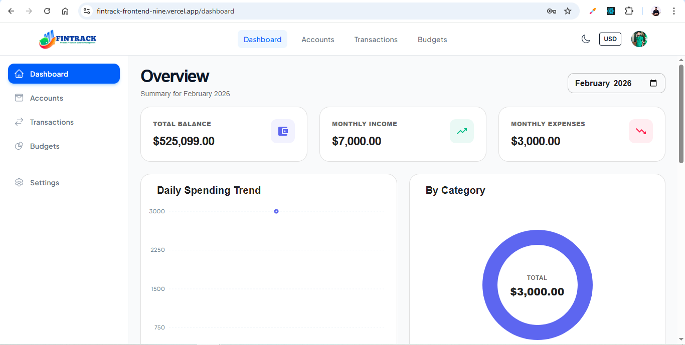
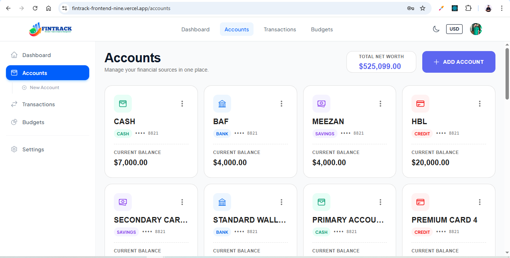
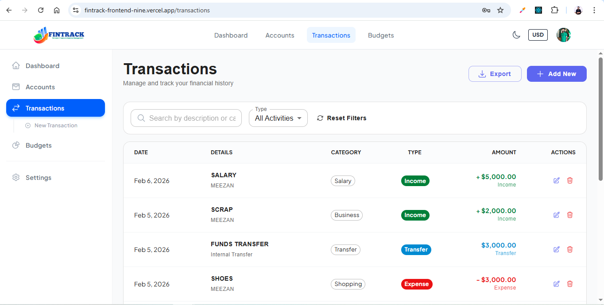
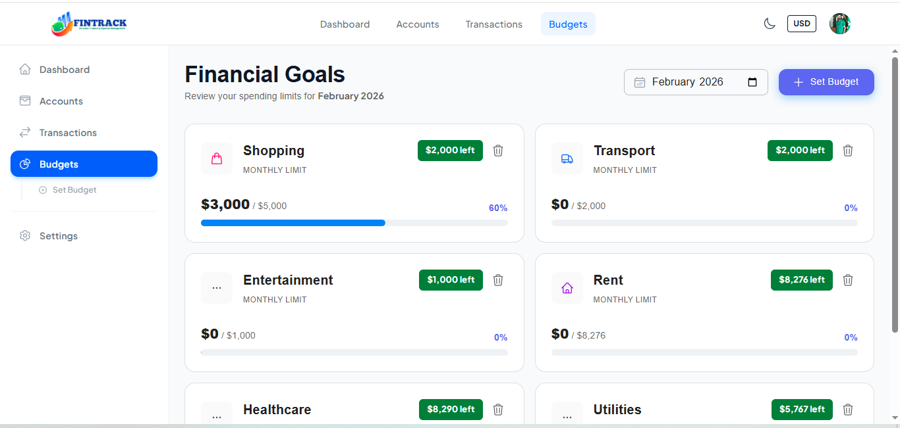

# 💰 FinTrack - Personal Finance & Expense Management

🔗 **Live Demo:** [FinTrack](https://fintrack-frontend-nine.vercel.app)  
📂 **GitHub Repo:** [GitHub Repo](https://github.com/riz-33/FinTrack_Frontend/)

---

### Made with ❤️ by [Muhammad Rizwan](https://www.linkedin.com/in/muhammad-rizwan-quettawala-1a462b18b/)

---

## 📌 Project Description

**FinTrack - Personal Finance & Expense Management** is a full-stack web application designed to help individuals, freelancers, and early-stage professionals manage their finances using **real-world accounting logic**.

The system supports multiple accounts, income/expense tracking, transfers, budgeting, analytics dashboards, and reporting — all built with scalability and SaaS-readiness in mind.

This project goes beyond basic CRUD operations by focusing on **financial data consistency, automated balance handling, and insightful dashboards**.

---

## 🌟 Key Features

### 🔐 Authentication
- Email & password login
- Password reset
- User profile with base currency preference

### 💳 Accounts / Wallets
- Cash, Bank, Credit Card, E-Wallet
- Opening balance support
- Automatic account balance updates on every transaction

### 💸 Transactions
- Income, Expense, and Account-to-Account Transfers
- Category, date
- Recurring transactions (salary, rent, subscriptions)

### 🗂 Categories
- Default system categories
- Custom user-defined categories
- Icons & color support

### 📊 Dashboard
- Total balance overview
- Monthly income vs expense comparison
- Category-wise expense pie chart
- Daily & monthly trends

### 📈 Reports & Budgets
- Monthly & yearly financial reports
- Account-wise summaries
- Category budgets with progress indicators
- Overspending alerts
- Export reports

### 🌍 SaaS Features
- Multi-currency support
- User-level data isolation
- Scalable SaaS architecture

---

## 🚀 Tech Stack

| Area       | Technology |
|------------|------------|
| Frontend   | React |
| UI Library | Material UI |
| Charts     | Recharts  |
| Backend    | Node.js, Express |
| Auth       | JWT Authentication |
| Database   | MongoDB, Mongoose |
| Deployment | Vercel, MongoDB Atlas |

---

## 🗄 Database Design (Simplified)

```js
User {
  name,
  email,
  currency,
  avatar,
  createdAt
}

Account {
  userId,
  name,
  type,
  balance,
  currency
}

Transaction {
  userId,
  accountId,
  type, // income | expense | transfer
  categoryId,
  amount,
  date,
  note
}

Category {
  userId,
  name,
  type // income | expense
}

---

## 💻 **Installation**

```bash
git clone https://github.com/riz-33/FinTrack_Frontend.git
cd finTrack-frontend
npm install
npm run dev
```

---

## 📸 Screenshots

| Dashboard                                            | Accounts Page                                           |
| ---------------------------------------------------- | ------------------------------------------------------- |
|  |  |

| Transactions Page                                               | Budgets Page                                          |
| --------------------------------------------------------------- | ----------------------------------------------------- |
|  |  |

---

## 🤝 **Contributing**

Contributions are welcome!
Please open an issue first to discuss any major changes.

---

## 💬 **Feedback**

If you have any feedback, please reach out via **LinkedIn:** [Muhammad Rizwan](https://www.linkedin.com/in/muhammad-rizwan-quettawala-1a462b18b/)

---

Thanks for visiting! ⭐ Don’t forget to Star the repo if you like it ✨
